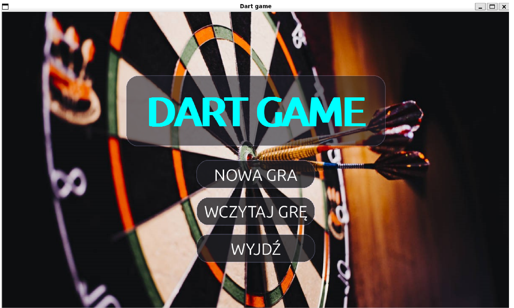
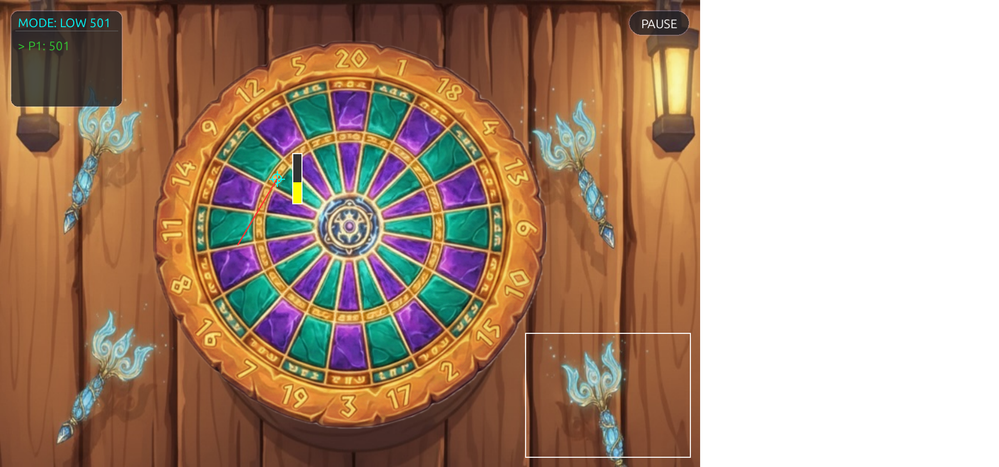
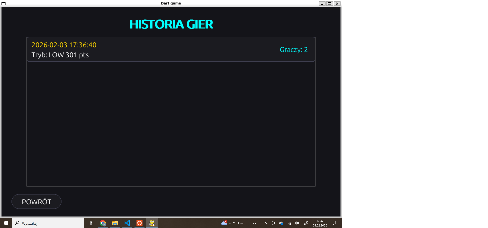
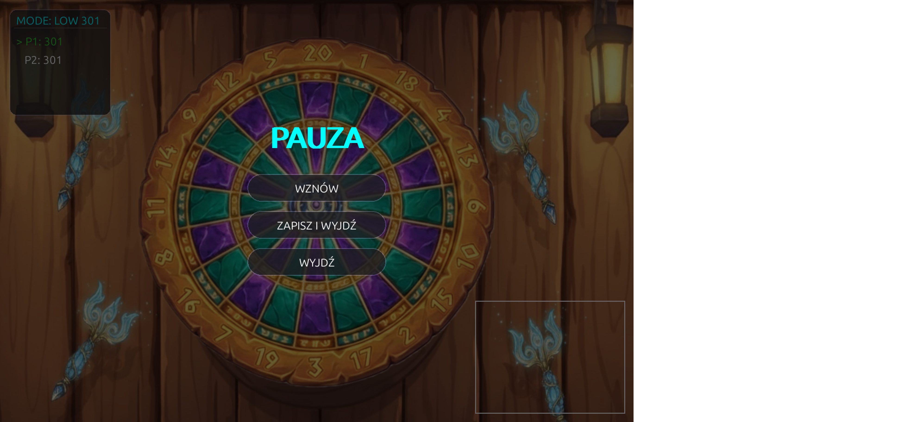

# AI-Powered Computer Vision Dart Game

An interactive, real-time dart simulation application built with Python. The game utilizes computer vision and machine learning models to track player gestures and throwing mechanics via camera, featuring a fully custom modular PyGame user interface.

---

## Key Features

* **Real-Time Motion Tracking:** Uses camera input to detect hands and body posture for aiming and throwing darts physically.
* **Dual Control Modes:**
  * **Camera / AI Mode:** Full gesture control using real-time frame analysis.
  * **Touchpad / Mouse Fallback:** Click-and-drag mechanics for alternative gameplay.
* **Game Modes & Multiplayer:**
  * **LOW Mode:** Classic countdown format (e.g., 301/501 down to 0).
  * **HIGH Mode:** Race to achieve the highest target score.
  * Local turn-based multiplayer supporting up to **10 players**.
* **State Persistence:** Built-in game saving and resuming via JSON serialization.

---

## Architecture & Technical Highlights

This project was engineered with a heavy focus on performance, real-time image processing, and clean architecture:

* **Multi-Threaded Video Pipeline:** Camera frame ingestion is isolated into a separate thread to ensure zero UI lag and maintain continuous 60 FPS gameplay rendering.
* **MediaPipe Gesture Recognition:** Integrated MediaPipe `Hands` and `Pose` estimation models for tracking keypoints (hips, hands, wrists) in real time.
* **Custom AI Throw Assessment Engine:** Proprietary motion assessment module that evaluates throwing velocity, release point, aiming vector, and target hit calculation on the dartboard.
* **Developer Debug Overlay:** Live debugging UI displaying MediaPipe keypoints, tracking lines, and bounding vectors for real-time model evaluation.
* **Modular UI Engine:** Custom UI wrapper built on PyGame featuring reusable UI components (`Button`, `Radio Pills`, `Pickup Action Bar`, `Skin Selector Preview Box`, and session setup forms).

---

## Tech Stack

* **Language:** Python 3.x
* **Computer Vision & AI:** OpenCV, MediaPipe, NumPy
* **Graphics & Rendering:** PyGame
* **Data Storage:** JSON

---

## Screenshots

| Game Setup & Gameplay | History & Save Systems |
| :---: | :---: |
|  |  |

| Pause Menu |
| :---: |
|  |

---

## Getting Started

### Prerequisites
Make sure you have Python installed, along with a working webcam.

### Installation

1. **Clone the repository:**
   git clone [https://github.com/tomeko21/Dart_Game](https://github.com/tomeko21/Dart_Game.git)
   cd Dart_Game
   